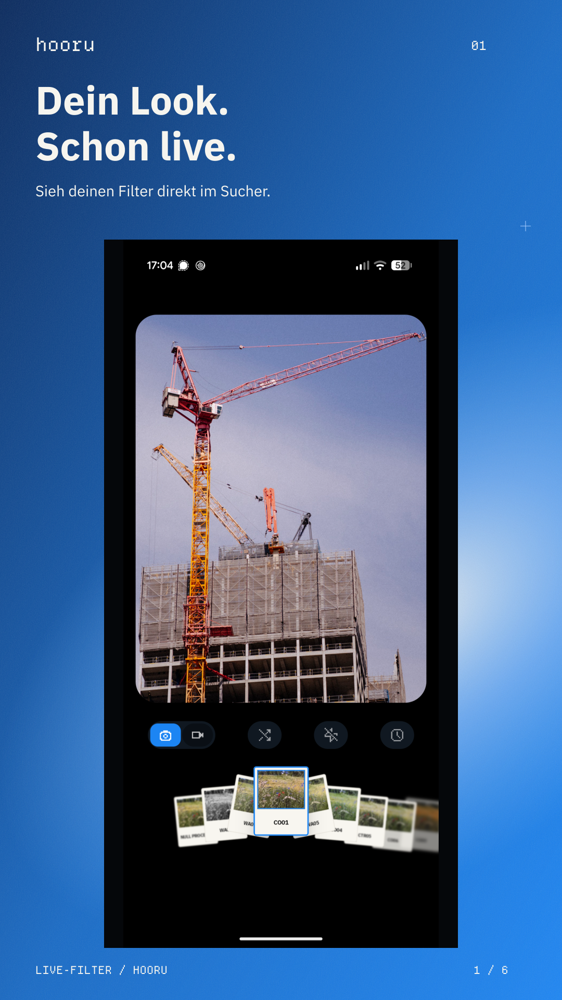
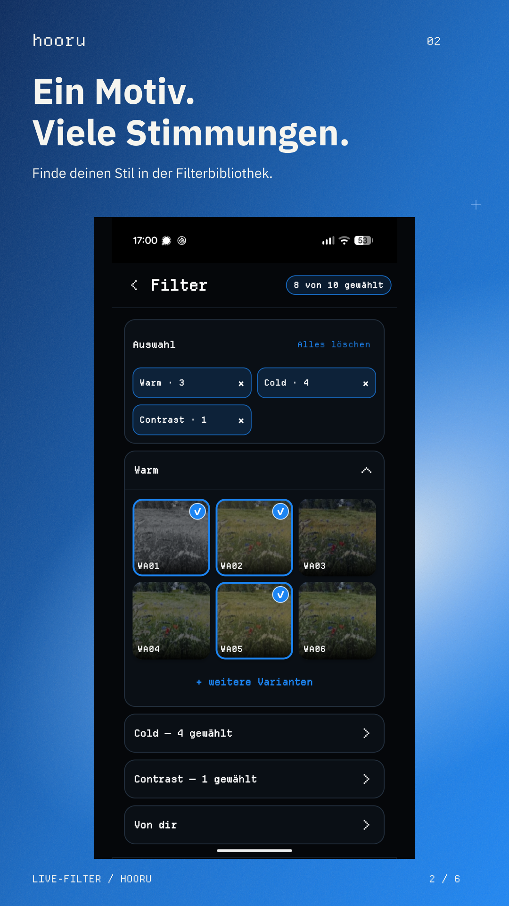
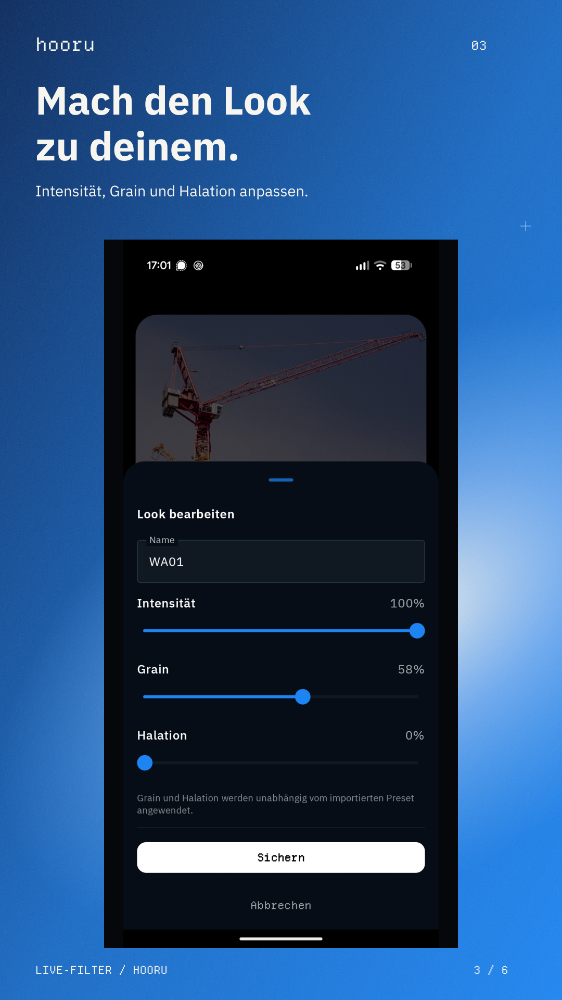
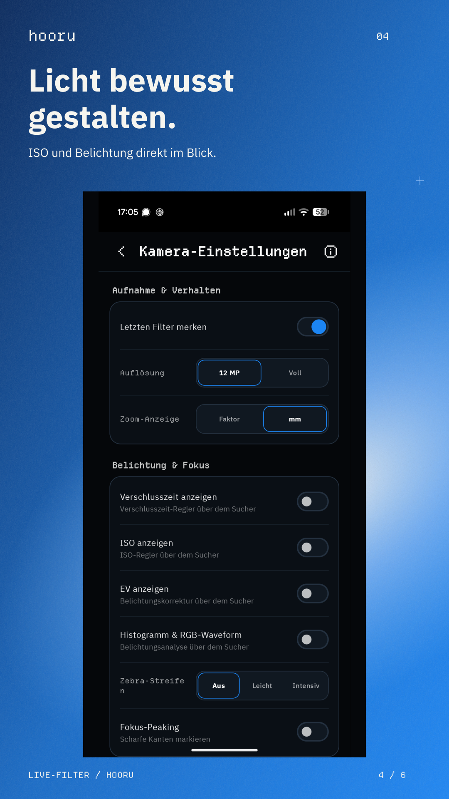
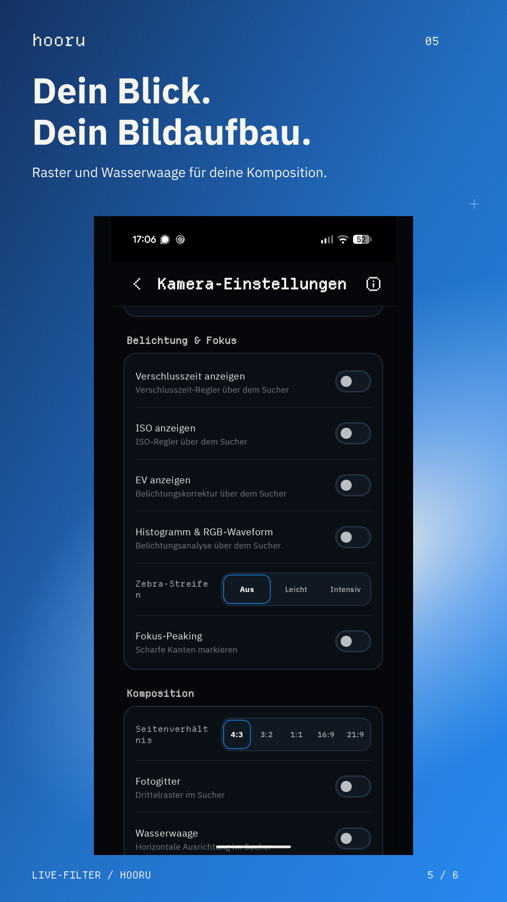
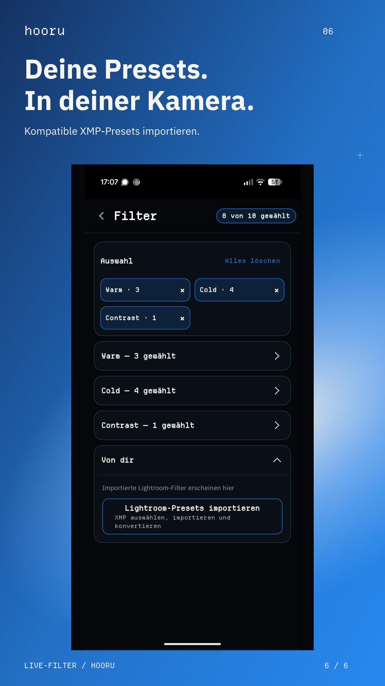

# Hooru

Eine kleine Android-Kamera-App mit Live-Filtern und Presets.

## Installieren

Die aktuelle installierbare Android-APK liegt unter
[`android/hooru-1.0.8-aspect-fix-debug.apk`](android/hooru-1.0.8-aspect-fix-debug.apk).
Die APK auf ein Android-Gerät übertragen, in dessen Dateimanager öffnen und die
Installation aus dieser Quelle erlauben. Alternativ steht dieselbe Datei bei den
GitHub-Releases zum Download bereit.

  
  
  
  
  
  

