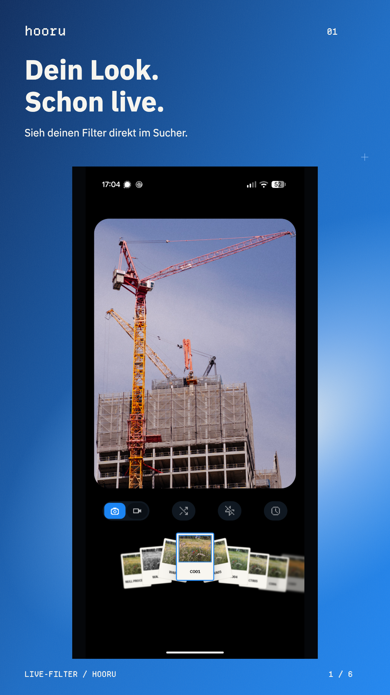
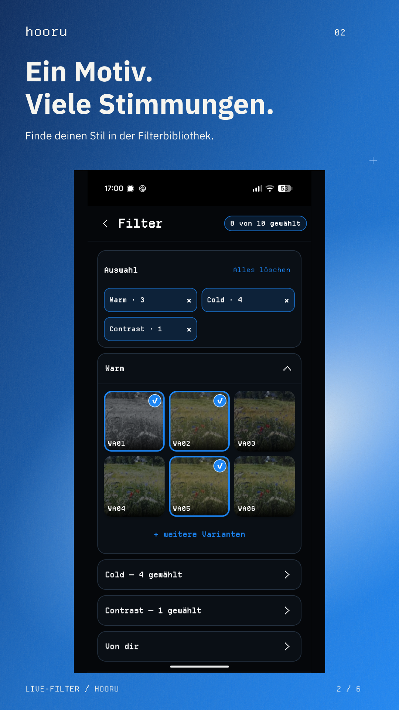
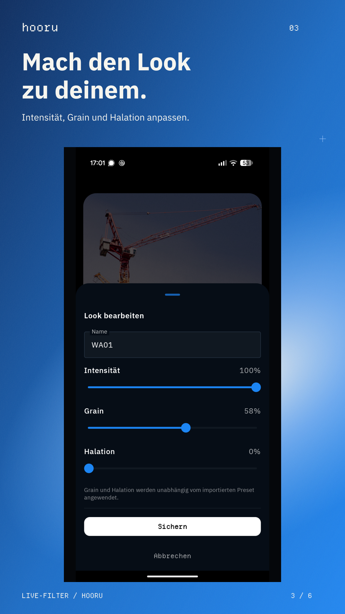
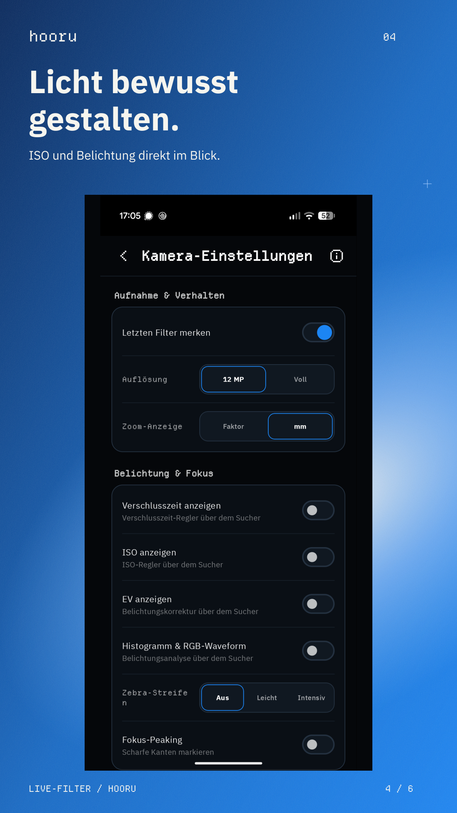
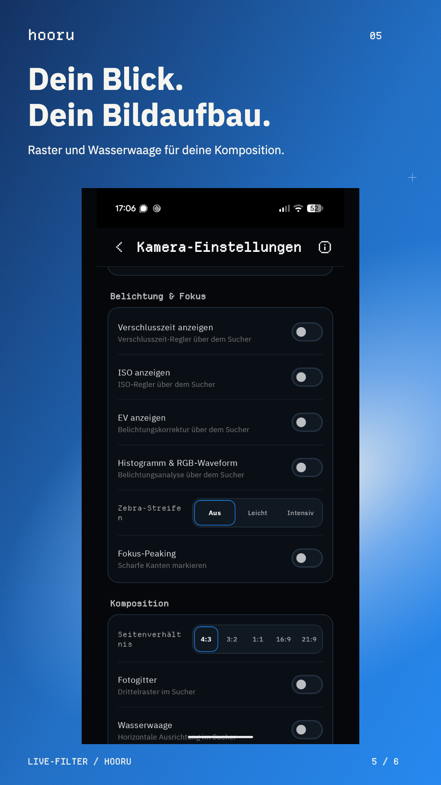
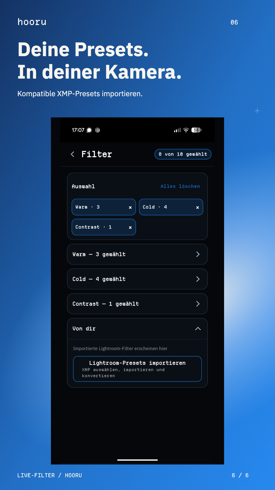

# Hooru

Eine kleine Android-Kamera-App mit Live-Filtern und Presets.

## Installieren

Die aktuelle Android-Version ist 1.0.9. Die signierte Release-APK liegt unter
[`android/hooru-1.0.9-release.apk`](android/hooru-1.0.9-release.apk).
Für ein Update der zuvor veröffentlichten Debug-APK gibt es
[`android/hooru-1.0.9-debug.apk`](android/hooru-1.0.9-debug.apk), die mit demselben
Debug-Schlüssel signiert ist. Die beiden APKs verwenden unterschiedliche Signaturen
und können sich daher nicht gegenseitig aktualisieren.

Die passende APK auf ein Android-Gerät übertragen, im Dateimanager öffnen und die
Installation aus dieser Quelle erlauben. Beide Dateien stehen auch beim
GitHub-Release zum Download bereit.

  
  
  
  
  
  

